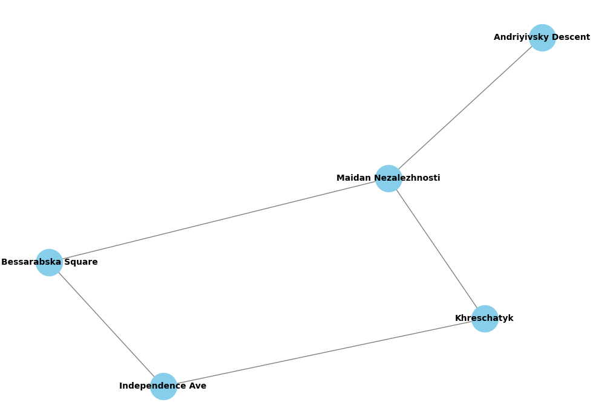
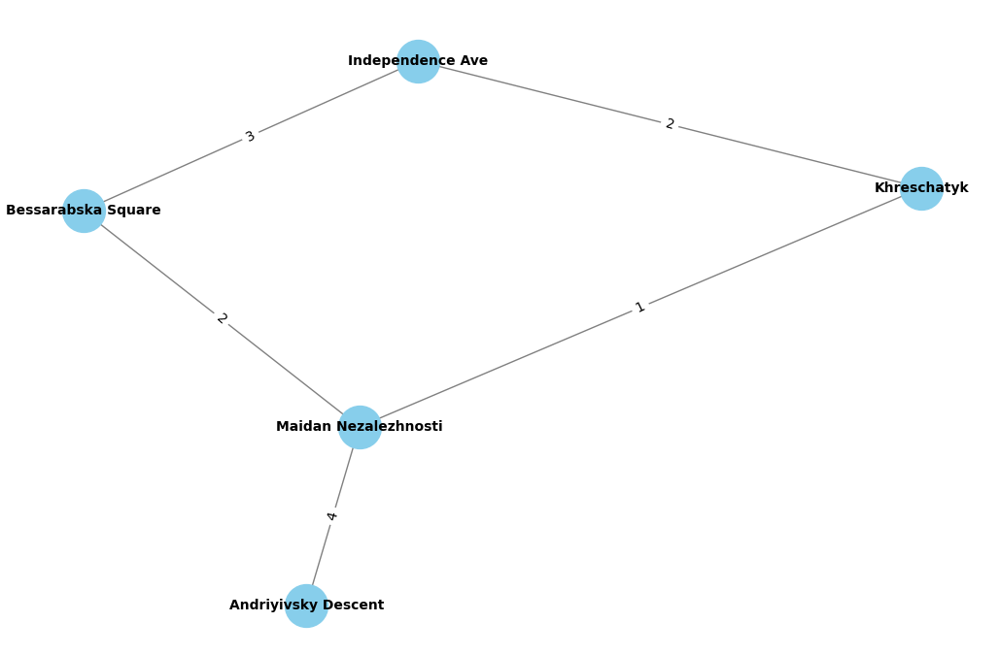

# goit-algo-hw-06

[Тема 6. Графи](https://www.edu.goit.global/uk/learn/13571785/19646173/19658290/training)

# Завдання 1: Створення та візуалізація графа

Список усіх вузлів графа:

- Khreschatyk
- Independence Ave
- Bessarabska Square
- Maidan Nezalezhnosti
- Andriyivsky Descent

Список усіх ребер графа:

- ('Khreschatyk', 'Independence Ave')
- ('Khreschatyk', 'Maidan Nezalezhnosti')
- ('Independence Ave', 'Bessarabska Square')
- ('Bessarabska Square', 'Maidan Nezalezhnosti')
- ('Maidan Nezalezhnosti', 'Andriyivsky Descent')

Кількість вершин: 5

Кількість ребер: 5

Ступінь вершин:

- Khreschatyk: 2
- Independence Ave: 2
- Bessarabska Square: 2
- Maidan Nezalezhnosti: 3
- Andriyivsky Descent: 1

Граф є зв'язним: True

Ступінь центральності (Degree Centrality):

- Khreschatyk: 0.5
- Independence Ave: 0.5
- Bessarabska Square: 0.5
- Maidan Nezalezhnosti: 0.75
- Andriyivsky Descent: 0.25

Близькість вузла (Closeness Centrality):

- Khreschatyk: 0.67
- Independence Ave: 0.57
- Bessarabska Square: 0.67
- Maidan Nezalezhnosti: 0.8
- Andriyivsky Descent: 0.5

Посередництво вузла (Betweenness Centrality):

- Khreschatyk: 0.17
- Independence Ave: 0.08
- Bessarabska Square: 0.17
- Maidan Nezalezhnosti: 0.58
- Andriyivsky Descent: 0.0

# Завдання 2: DFS і BFS алгоритми для знаходження шляхів

DFS шляхи:

1. ['Khreschatyk', 'Independence Ave', 'Bessarabska Square', 'Maidan Nezalezhnosti', 'Andriyivsky Descent']
2. ['Khreschatyk', 'Maidan Nezalezhnosti', 'Andriyivsky Descent']

BFS шляхи:

1. ['Khreschatyk', 'Maidan Nezalezhnosti', 'Andriyivsky Descent']
2. ['Khreschatyk', 'Independence Ave', 'Bessarabska Square', 'Maidan Nezalezhnosti', 'Andriyivsky Descent']

Різниця у шляхах обумовлена особливостями роботи кожного з алгоритмів:

<b>DFS (Depth-First Search)</b>: алгоритм просувається глибше вглиб графу, обираючи один із шляхів і просуваючись
максимально глибоко, перш ніж повертатися та рухатися по іншому. Таким чином, DFS може вибрати шлях, який йде глибше
вглиб графу, ніж інші шляхи.

<b>BFS (Breadth-First Search)</b>: алгоритм просувається шар за шаром графу, обираючи найкоротший шлях від стартової
вершини до кожної іншої вершини на поточному рівні. Таким чином, BFS зазвичай знаходить коротший шлях, який пролягає
через менше вершин на одному рівні.

Обидва алгоритми гарантовано знаходять шляхи, які існують у графі, але їхні різні підходи можуть впливати на порядок
обрання шляхів та їхню довжину.

# Завдання 3: Алгоритм Дейкстри для знаходження найкоротшого шляху

Найкоротші шляхи за алгоритмом Дейкстри:

| Від         | До                   | Відстань |
|-------------|----------------------|----------|
| Khreschatyk | Khreschatyk          | 0        |
| Khreschatyk | Independence Ave     | 2        |
| Khreschatyk | Bessarabska Square   | 3        |
| Khreschatyk | Maidan Nezalezhnosti | 1        |
| Khreschatyk | Andriyivsky Descent  | 5        |

